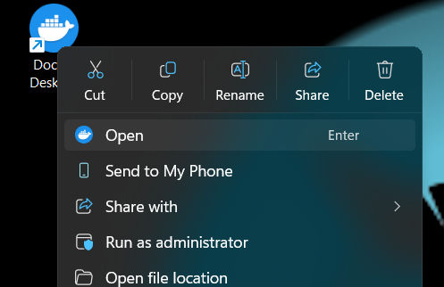
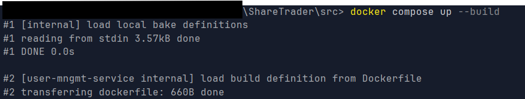
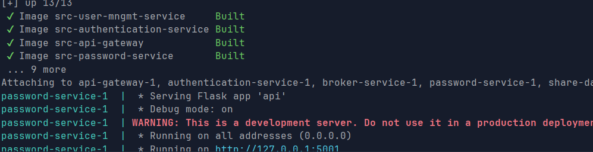
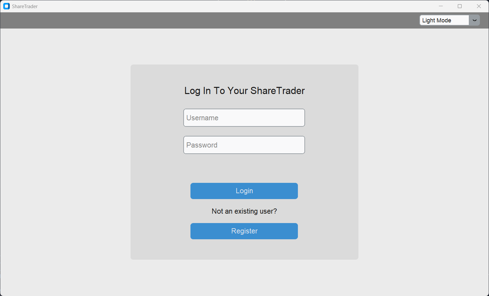

# Coursework - Share Trader Application

> Mateusz Pasternak\
> 40663397\
> MEng Software Engineering

## Start-Up Instructions

### 1. Start the Docker engine.

To start the docker engine on desktop, simply open the desktop GUI application.



### 2. Start the containers.

To start the containers, navigate to the `src` directory. From there, run the following docker command:
```
docker compose up --build
```


This should start creating images of all registered microservices.



### Start the GUI Application

To launch and use the application, navigate to the `src/app` and run

```
python main.py
```

This should start a TKinter GUI application from the user login page.

